# Bundoo Cakes
## Static site for a craft bakery

> Live site available here: [Bundoo Cakes](https://www.bundoocakes.ie)

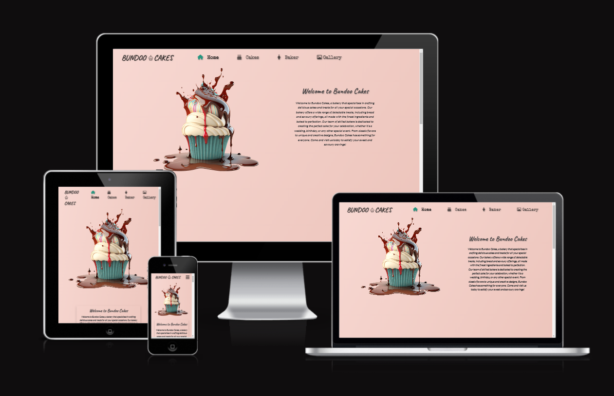

## Table of Contents

- [Description](#description)
- [Theme](#theme)
- [Features](#features)
- [Testing](#testing)
- [Technologies](#technologies)
- [Deployment](#deployment)
- [Credits](#credits)
- [Author Info](#author-info)

------

## Description
This is a static site built using HTML, CSS/Bootstrap & Javascript for a craft bakery.
Deciding on this project was pretty easy as it has been built as a real world, live site for a friend of mine's home bakery business.
Although she already has a presence on social media, this site provides another avenue for potential customers to find her products. It includes pictures, information, prices and a form to get in touch with the baker directly for information or to make an order. 

Having a website alongside social media accounts can help to create a centralized hub for potential customers to find information about the products and services on offer. A website can also act as a powerful marketing tool, allowing them to showcase their brand and create a professional online presence. Additionally, it can help them to drive more traffic to their social media accounts, as well as providing a platform for collecting valuable customer data.

According to a report by Bord Bia (the Irish Food Board), the bakery sector in Ireland is estimated to be worth over €500 million per year, with the artisanal and craft bakery sector representing a significant portion of that market. This report also notes that there has been a growing demand for artisanal and craft bakery products in Ireland, particularly among younger consumers who are seeking out high-quality, locally produced food products.

------
## Theme 

The main theme chosen for this site was 'Simplicity', the question I considered at every step was:

`Is it
Minimal, Clean, Slick, Professional?`

Therefore I chose only a few simple colors to highlight the quality of the images themselves.

These were:
A liner gradient on the body that shifts between shades of pink and green:

-  `#f8d9d3`
-  `#ebc2b9`
-  `#cbdabc`
-  `#a1c8b9`

Dark Green used for buttons, navbar and the footer. 
-  `#23967f`

To ensure it was visible over the chosen elements background color the text was then either:
-  `Whitesmoke - #f5f5f5`

or
-  `Black - #000000`

The images contained these colors but were also rich in various hues of yellow, orange, red, green and blue.
By keeping the color scheme simple the colors in the images get to take center stage.

I then implemented a scroll style which would maximize the impact of the header image.
By giving the header image a position of "sticky" it would stick to the top of the page and let the following text roll over the top.

------
## Wireframes
BalsamiQ was used to create Desktop and Mobile designs for each page of the site (Tablet size devices follow the Mobile design layout).

### Home-Page Wireframe
 

### Cakes-Page Wireframe
 

### Baker-Page Wireframe
 

### Gallery Wireframe
 

[Back to the Top](#bundoo-cakes)

---

## Features

> ### Navigation menu 

On mobile the main navigation menu is housed inside a hamburger menu. This slides open from the side and includes all navigation links. This was based on a bootstrap 5 navbar.
On tablets or bigger devices the menu is spread across the header bar which also contains the logo.

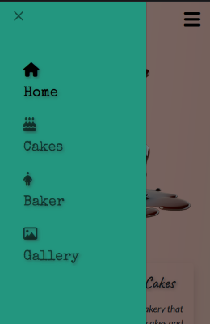

> ### Logo 

The logo is simply the name of the bakery and a picture of a cupcake, this sits at the top left of the page and is universal across the site.

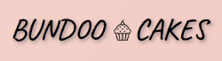

> ### Hero Image 

The Hero image is a large png of an AI generated cupcake, it sits a the top of the home page. It's background is transparent so the animated linear-gradient effect can be seen flowing around it. 

  

> ### Footer 

The Footer includes a small block at the bottom of the page with a link to the web developers site and a large section that includes newsletter sign up, company information/contact information and social media links.

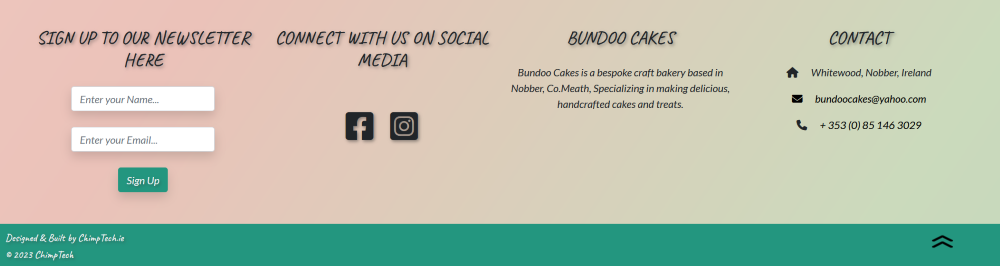

> ### Home Page  

This page gives an introduction to the bakery, it includes a ["Featured Products"](./docs/featured-products.png) section to help capture potential customers attention and a ["Testimonials"](./docs/testimonials.png) section to further assure potential customers that they are in the right place.

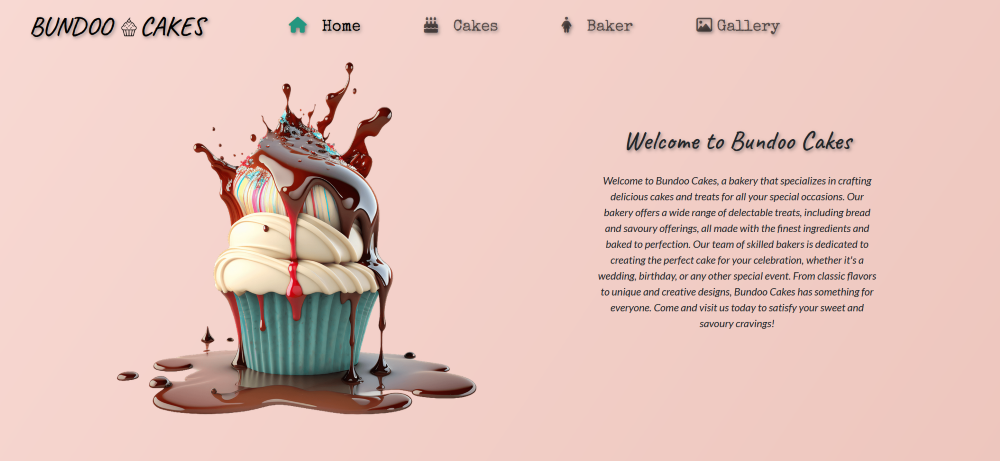

> ### Cakes Page 

This page gives an overview of the types of cakes that are made, the services available, the prices and plenty of pictures.

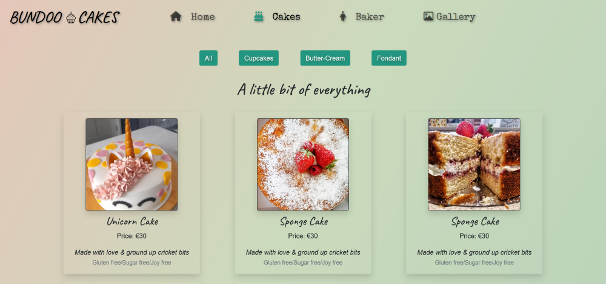

> ### Baker Page 

Here you will find information on the company owner and main baker Jenn.

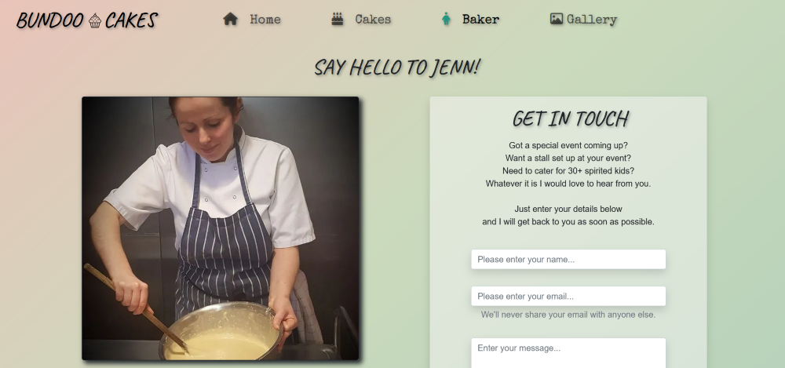

> ### Image Gallery 

This page holds numerous high quality images.

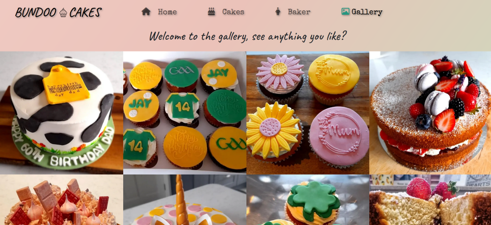

[Back to the Top](#bundoo-cakes)

---

## Testing

Testing was done in a number of ways.

 > #### Manual Testing
 
 This was undertaken by myself, my wife and a number of friends.
 We tested all links to confirm they worked and opened on a new blank page and went where they were supposed to. Multiple devices were used to confirm the site worked as it should and it displayed correctly across different screen sizes and browsers.

 > #### Online Testing

 All code was run through a validator and returned zero errors.
 These validator sites were:

- [Jigsaw css Validator](https://jigsaw.w3.org/css-validator/#validate_by_uri)
- [W3C Validator](https://validator.w3.org/)
- [JsHint Validator](https://jshint.com/)

Screenshots of all these results can be found below.

CSS

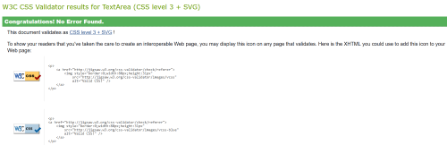

HTML, All pages returned the same result.

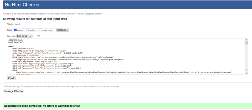

JavaScript

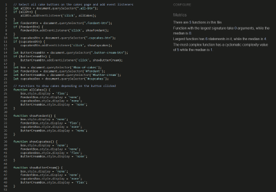

> #### Responsive Testing

This website allowed me to select a number of devices with different size screens and viewports and see how my website looked on each of them. The result of which is displayed [here](#bundoo-cakes) at the top of this page

- [Responsive Checker](https://ui.dev/amiresponsive)

> #### Google Lighthouse

Google Lighthouse is an open-source, automated tool for auditing the performance, accessibility, best practices, and search engine optimization (SEO) of web pages. It was created by Google and is built into Google Chrome's DevTools, making it easily accessible for developers and webmasters.

Lighthouse provides a comprehensive report on a web page's performance, including metrics such as load time, page size, and number of requests. It also identifies areas for improvement and provides recommendations on how to fix them.

In addition to performance, Lighthouse also analyzes a page's accessibility, including color contrast, keyboard navigation, and other factors that affect users with disabilities. It also checks for adherence to best practices, such as use of HTTPS and correct use of images and metadata.

The results of this report are shown below.

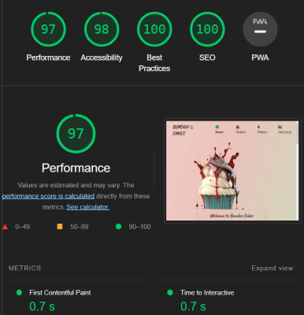

### Website Optimization & SEO

> ##### Optimization
To help the site reach a broader audience some optimization methods were implemented, these included -
- Speed Optimization

Photos were cropped, compressed and converted to a web friendly format. Pre-load, Lazy loading and defer methods were used when loading resources to help speed up content delivery
- UX Optimization

Intuitive navigation, clear calls to action and a simple, easy to follow layout were adopted from the start. 
Ensuring all images were served with an alt text, adhering to proper heading structure and ensuring the contrast between text and background colors were some of the ways I improved accessibility.

> ##### SEO
A few simple measures were introduced to improve the sites visibility to search engines, these included -
- Meta Tags

 Description tag, to give the potential visitor to the site an enticing message.

 Keywords tag, this provides a list of keywords to help search engines understand the content of the site.

- Robots.txt file

Here we can tell web crawlers which pages they can or cannot visit, this is useful for sites that are still under construction or have pages that are not ready for public viewing.

- Sitemap.xml file

This tells search engines which pages to index. By creating and submitting a sitemap, it can help to ensure that the site is indexed for search engines.

[Back to the Top](#bundoo-cakes)

---

## Technologies

- HTML
- CSS
- Bootstrap 5
- JavaScript
- Git
- GitHub
- Visual Studio Code
- Balsamiq
- Markdown
- FontAwesome
- Google Fonts

#### Resources

- NCI Curriculum
- YouTube
- Udemy
- FreeCodeCamp
- W3Schools
- MDN Web Docs

[Back to the Top](#bundoo-cakes)

---

## Deployment

The steps below will outline how to deploy, clone or fork this repository.
These steps assume that you have a GitHub account, if not please start [here](https://www.github.com) by creating a GitHub account.

This project was deployed using GitHub pages.
The procedure for doing this is very straight forward.

- Inside the repository click on the button marked "Settings".
- In the side bar on the left click on the button marked "Pages".
- Under the source title you have two drop down menus, make sure the first is set to "Main" and the second to "Root" and click "Save".
- Within a couple of minutes the site was live and I received a notification indicating the url.

### Cloning

To clone this repository just follow the steps below.

- Navigate to the Repositories section in my GitHub portfolio.
- Click on the Repository you want to clone (BundooCakes).
- Click the button labeled "Code" and copy the link shown.
- Open a new folder or your preferred location in your GitPod/VsCode workspace.
- Type "git clone" into the terminal, paste the link and click Enter.
- Job done, you have created a clone of this repository.

### Fork this repository

To fork this repository just follow the steps below.

- Navigate to the repository you wish to fork.
- On the top right of the page click on the button marked "fork".
- The repository has now been cloned and you can find it in your account.

[Back to the Top](#bundoo-cakes)

---

## Credits
#### Bootstrap 
Bootstrap was used for it's grid functionality to provide responsiveness across different device sizes.
It's pre-built components were also used to help speed up the development process, these were a hamburger menu and an accordion drop down for customer testimonials.
- `The Bootstrap Authors. (2023). Bootstrap v5 GitHub. https://github.com/twbs/bootstrap/releases/tag/v5.0.0`

#### Font Awesome
Font Awesome was used for the icons on the site. Social media links, Navbar images
- `Fonticons, Inc. (2022). Font Awesome 6.0.0 - Heart icon. Fonticons, Inc. https://fontawesome.com`

#### PNG tree
pngtree is a place to get free png images. The main cupcake image used as the background image on the home page was sourced from here.
- `pngtree.com. (2023). melt PNG Designed By wangmin11134. https://pngtree.com/freepng/fashion-cartoon-three-dimensional-3d-cupcake-paint-chocolate-melting-model_9015323.html?sol=downref&id=bef`

#### EmailJS
Emailjs has a paid service and a free open source version for developers to use. This was used to send the contact form data to the client's email address.
- `EmailJS. (2023). EmailJS 3.2.0. EmailJS. https://www.emailjs.com/`

#### Flat Icon
flaticon.com was used to source 2 free icons for the site, these were the black and white cupcake from the logo and the back-to-top chevrons.
- `Flaticon. (2023). Cupcake icons created by nawicon. Flaticon. https://www.flaticon.com/free-icons/cupcake`
- `Flaticon. (2023). Double arrow icons created by Rahul Kaklotar. https://www.flaticon.com/free-icons/double-arrow`

#### Other Media & Content
All other images and text content were the property of Bundoo Cakes and were provided by the client.

[Back to the Top](#bundoo-cakes)

---

## Author Info

Ken Sheridan, Full Stack Software Developer.
- [GitHub](https://github.com/KSheridan86)
- [Linkedin](https://www.linkedin.com/in/kensheridan86/)

[Back to the Top](#bundoo-cakes)