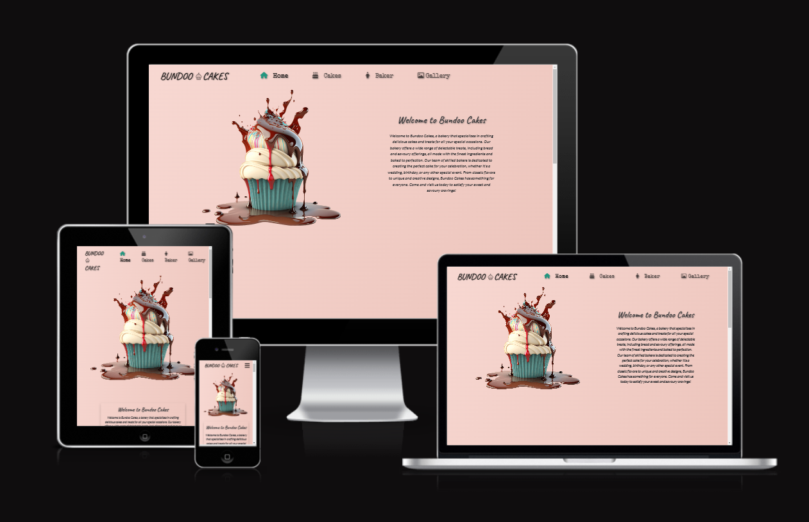
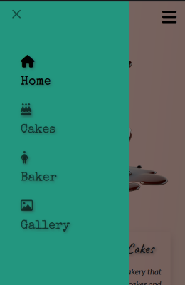
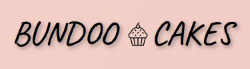
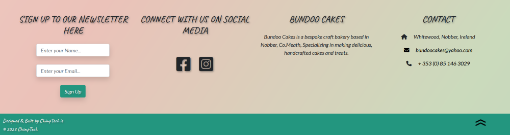
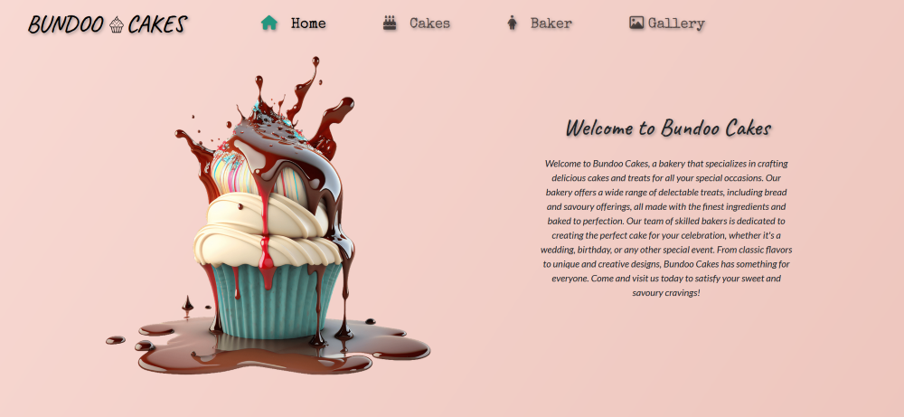
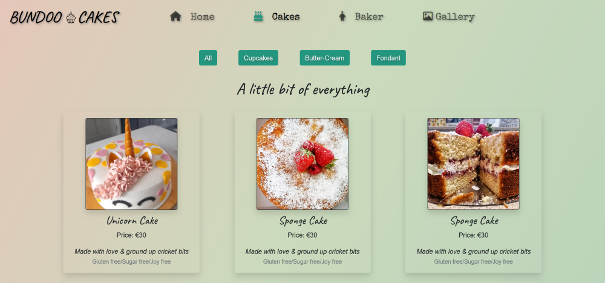
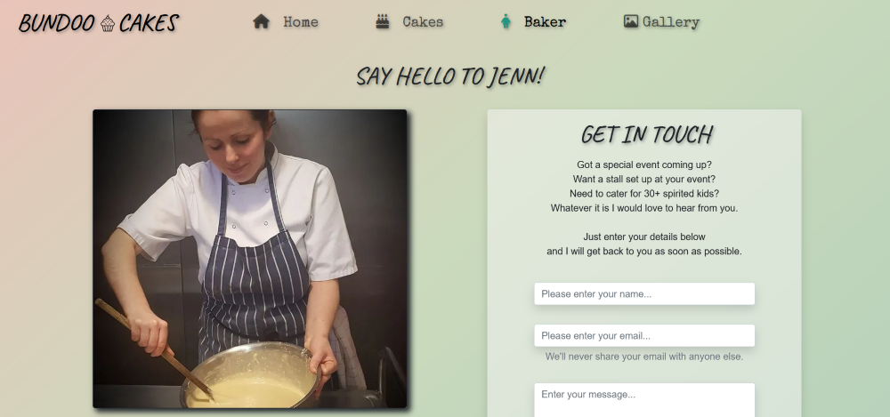
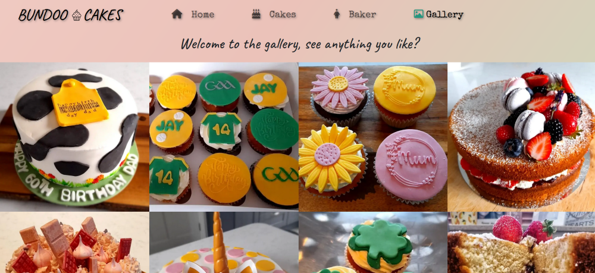

# Bundoo Cakes
## Static site for a craft bakery

> Live site available here: [Bundoo Cakes](https://www.bundoocakes.ie)

## Table of Contents

- [Description](#description)
- [Theme](#theme)
- [Features](#features)
- [Testing](#testing)
- [Technologies](#technologies)
- [Deployment](#deployment)
- [Credits](#credits)
- [Author Info](#author-info)

------

## Description
This is a static site built using HTML, CSS/Bootstrap & Javascript for a craft bakery.
Deciding on this project was pretty easy as it has been built as a real world, live site for a friend of mine's home bakery business.
Although she already has a presence on social media, this site provides another avenue for potential customers to find her products. It includes pictures, information, prices and a form to get in touch with the baker directly for information or to make an order. 

Having a website alongside social media accounts can help to create a centralized hub for potential customers to find information about the products and services on offer. A website can also act as a powerful marketing tool, allowing them to showcase their brand and create a professional online presence. Additionally, it can help them to drive more traffic to their social media accounts, as well as providing a platform for collecting valuable customer data.

------
## Theme 

The main theme chosen for this site was 'Simplicity', the question I considered at every step was:

`Is it
Minimal, Clean, Slick, Professional?`

Therefore I chose only a few simple colors to highlight the quality of the images themselves.

These were:
A liner gradient on the body that shifts between shades of pink and green:
- #f8d9d3
- #ebc2b9
- #cbdabc
- #a1c8b9

Dark Green used for buttons, navbar and the footer. 
- #23967f 

To ensure it was visible over the chosen elements background color the text was then either:
- #f5f5f5 WhiteSmoke
or
- #000000 Black

The images contained these colors but were also rich in various hues of yellow, orange, red, green and blue.
By keeping the color scheme simple the colors in the images get to take center stage.

I then implemented a scroll style which would maximize the impact of the header image.
By giving the header image a position of "sticky" it would stick to the top of the page and let the following text roll over the top.

[Back to the Top](#bundoo-cakes)

---

## Features

> ### Navigation menu 
On mobile the main navigation menu is housed inside a hamburger menu. This slides open from the side and includes all navigation links. This was based on a bootstrap 5 navbar.
On tablets or bigger devices the menu is spread across the header bar which also contains the logo.

> ### Logo 
The logo is simply the name of the bakery and a picture of a cupcake, this sits at the top left of the page and is universal across the site.

> ### Hero Image 
The Hero image is a large png of an AI generated cupcake, it sits a the top of the home page. It's background is transparent so the animated linear-gradient effect can be seen flowing around it. 

  

> ### Footer 
The Footer includes a small block at the bottom of the page with a link to the web developers site and a large section that includes newsletter sign up, company information/contact information and social media links.

> ### Home Page  
This page gives an introduction to the bakery, it includes a ["Featured Products"](./docs/featured-products.png) section to help capture potential customers attention and a ["Testimonials"](./docs/testimonials.png) section to further assure potential customers that they are in the right place.

> ### Cakes Page 
This page gives an overview of the types of cakes that are made, the services available, the prices and plenty of pictures.

> ### Baker Page 
Here you will find information on the company owner and main baker Jenn.

> ### Image Gallery 
This page holds numerous high quality images.

[Back to the Top](#bundoo-cakes)

---

## Testing

Testing was done in a number of ways.

 > #### Manual Testing
 
 This was undertaken by myself, my wife and a number of friends.
 We tested all links to confirm they worked and opened on a new blank page and went where they were supposed to. Multiple devices were used to confirm the site worked as it should and it displayed correctly across different screen sizes and browsers.

 > #### Online Testing

 All code was run through a validator and returned zero errors.
 These validator sites were:

- [Jigsaw css validator](https://jigsaw.w3.org/css-validator/#validate_by_uri)
- [W3C Validator](https://validator.w3.org/)

Screenshots of all these results can be found below.

[CSS](./assets/docs/css.png)
[Home](./assets/docs/home.png)
[Cakes](./assets/docs/about.png)
[Baker](./assets/docs/operations.png)
[Gallery](./assets/docs/gallery.png)

> #### Responsive Testing

This website allowed me to select a number of devices with different size screens and viewports and see how my website looked on each of them.

- [Responsive Checker](https://ui.dev/amiresponsive)

> #### Google Lighthouse

 

[Back to the Top](#bundoo-cakes)

---

## Technologies

- HTML
- CSS
- Bootstrap 5
- JavaScript
- Git
- GitHub
- Visual Studio Code
- Markdown
- FontAwesome
- Google Fonts

#### Resources

- NCI Curriculum
- YouTube
- Udemy
- FreeCodeCamp
- W3Schools
- MDN Web Docs

[Back to the Top](#bundoo-cakes)

---

## Deployment

The steps below will outline how to deploy, clone or fork this repository.
These steps assume that you have a GitHub account, if not please start [here](https://www.github.com) by creating a GitHub account.

This project was deployed using GitHub pages.
The procedure for doing this is very straight forward.

- Inside the repository click on the button marked "Settings".
- In the side bar on the left click on the button marked "Pages".
- Under the source title you have two drop down menus, make sure the first is set to "Main" and the second to "Root" and click "Save".
- Within a couple of minutes the site was live and I received a notification indicating the url.

### Cloning

To clone this repository just follow the steps below.

- Navigate to the Repositories section in my GitHub portfolio.
- Click on the Repository you want to clone (BundooCakes).
- Click the button labeled "Code" and copy the link shown.
- Open a new folder or your preferred location in your GitPod/VsCode workspace.
- Type "git clone" into the terminal, paste the link and click Enter.
- Job done, you have created a clone of this repository.

### Fork this repository

To fork this repository just follow the steps below.

- Navigate to the repository you wish to fork.
- On the top right of the page click on the button marked "fork".
- The repository has now been cloned and you can find it in your account.

[Back to the Top](#bundoo-cakes)

---

## Credits

The code for the Hamburger menu used at the top of the page was taken from the first example on the website below and then redesigned for my particular needs.

- [Hamburger menu code](https://alvarotrigo.com/blog/hamburger-menu-css/)

All images, videos and information contained within this site were taken directly from one of four sites.

These being: 

- [The European Space Agency](https://www.esa.int/)
- [NASA](https://www.nasa.gov/mission_pages/hubble/main/index.html)
- [HubbleSite](https://hubblesite.org/)
- [STSci](https://www.stsci.edu/)

These sites allow free use of their content for education purposes and even commercial purposes once the correct credit is given.

`"Unless otherwise specifically stated, no claim to copyright is being asserted by STScI and material on this site may be freely used as in the public domain in accordance with NASA's contract. However, it is requested that in any subsequent use of this work NASA and STScI be given appropriate acknowledgement."`

[Back to the Top](#bundoo-cakes)

---

## Author Info

Ken Sheridan, Full Stack Software Developer.
- [GitHub](https://github.com/KSheridan86)
- [Linkedin](https://www.linkedin.com/in/kensheridan86/)

[Back to the Top](#bundoo-cakes)